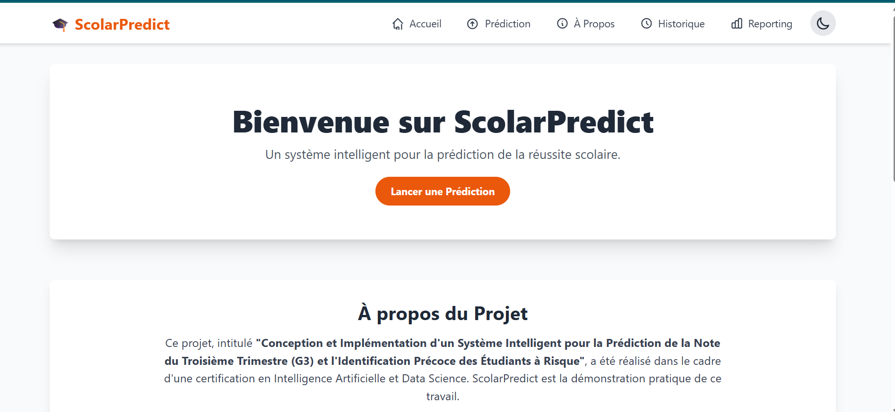
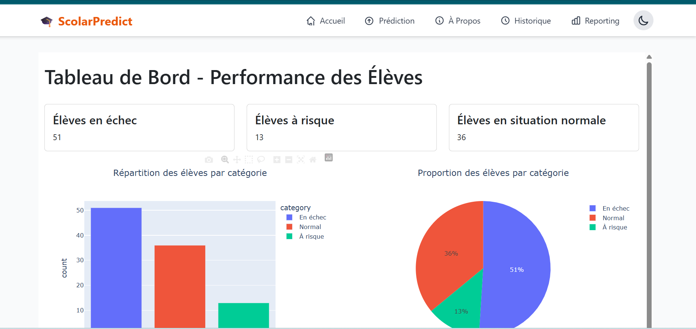
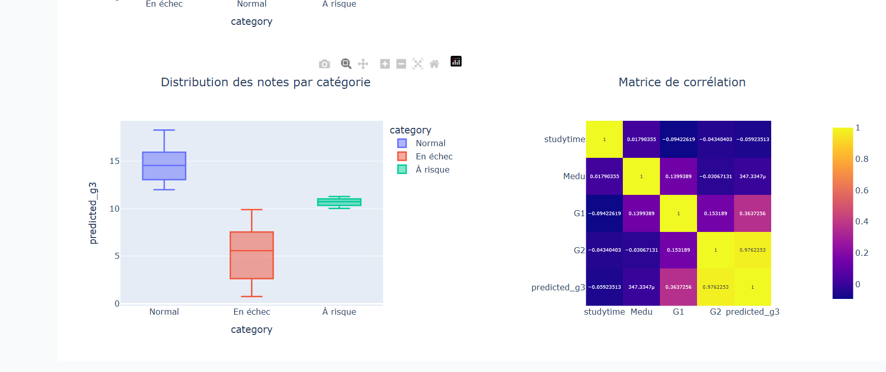

# Static Assets

Ce dossier contient les fichiers statiques utilisés par l'application Flask.

## Images de résultats

Graphique montrant la distribution des notes prédites (G3) pour l'ensemble des élèves. Ce résultat permet de visualiser la répartition des performances scolaires et d'identifier les tendances générales.

Analyse de la corrélation entre le temps d'étude (studytime) et les notes finales. Ce graphique illustre l'impact du temps consacré aux études sur la réussite scolaire.

Visualisation du pourcentage d'élèves à risque (notes inférieures à 10) par rapport aux élèves performants. Ce résultat aide à identifier la proportion d'élèves nécessitant un soutien particulier.

## Autres ressources

- **Photo.jpeg** : Image d'illustration pour l'application
- **education.jpg** : Image liée au thème de l'éducation
- **css/** : Feuilles de style pour l'interface utilisateur
- **js/** : Scripts JavaScript pour l'interactivité
- **plots/** : Dossier pour les graphiques générés dynamiquement
